# 🛡️ SENTINEL
### AI-Powered Supply Chain Security Auditor

  

> **"Protecting developers from the silent threat of AI-hallucinated packages."**

---

## 🚨 The Problem: AI Package Hallucinations
Large Language Models (LLMs) like ChatGPT and Claude are revolutionizing coding, but they come with a dangerous side effect: **Package Hallucination**.

* **The Threat:** LLMs often suggest library imports that *sound* real but do not exist (e.g., `huggingface-cli-v2` instead of `huggingface-hub`).
* **The Attack Vector:** Malicious actors can scan widely generated AI code, identify these "fake" names, and register them on PyPI or NPM.
* **The Consequence:** When a developer copy-pastes the AI's code and runs `pip install`, they unknowingly download malware instead of a helper library.

## 💡 The Solution: Sentinel
**Sentinel** is a real-time security auditor that acts as a firewall between AI-generated code and your development environment. It scans GitHub repositories and analyzes dependencies to detect:

1. **Hallucinations:** Packages that are imported but do not exist in official registries.
2. **Typosquatting:** Packages with names dangerously similar to popular libraries (e.g., `reqests` vs `requests`).
3. **Abandonment:** Libraries that haven't been updated in years and pose security risks.

---

## ⚙️ How It Works (The Algorithm)

Our engine utilizes a multi-layered approach to verify package integrity:

### 1. Registry Verification Protocol
We cross-reference every dependency found in `requirements.txt`, `package.json`, and `README.md` against the live **PyPI (Python)** and **NPM (Node.js)** APIs. If a package returns a 404, it is flagged as a potential **Critical Risk (Hallucination)**.

### 2. Levenshtein Distance & RapidFuzz
To detect **Typosquatting**, we use the `rapidfuzz` library to calculate the Levenshtein Distance (string similarity ratio) between the scanned package and a whitelist of the top 5,000 most popular open-source packages.
* *Threshold:* If similarity is >=85% but not an exact match, it is flagged as **High Risk**.

### 3. File Parser Engine
Our custom RegEx parser intelligently scans codebases for:
* Python: `pip install`, `import`, and `requirements.txt` syntax.
* Node.js: `npm install`, `package.json`, and `import` statements.

---
### 🔄 Security Logic Flow

```mermaid
graph TD
    A[User Inputs GitHub URL] --> B[FastAPI Backend]
    B --> C{Registry Check}
    C -->|Status 404 Not Found| D[🔴 CRITICAL: Hallucination]
    C -->|Status 200 OK| E{Levenshtein Check}
    E -->|Ratio == 100%| F[🟢 SAFE: Exact Match]
    E -->|Ratio >= 85%| G[🟠 HIGH RISK: Typosquatting]
    E -->|Ratio < 85%| H[🟢 SAFE: Unique Package]
```

---

## 🏗️ Architecture & Data Flow (Mandatory DFD)

### Level 1 Data Flow Diagram
This diagram illustrates how user input travels through our FastAPI gateway, processed by the Intelligence Engine, and validated against external databases.


  ---
### Logical Database Schema
Even though we utilize a high-speed Redis cache, our logical data structure ensures consistent reporting.


---
### **2. For the "CI/CD Integration" (The YAML Code)**
This is just a standard code block. You use `yaml` to get the colorful syntax highlighting.

## 🔌 CI/CD Integration (Impact)
Sentinel is designed for enterprise workflows. We provide a **GitHub Action** that runs automatically on every Pull Request to block malicious dependencies before they merge.

**Workflow Configuration** (`.github/workflows/sentinel_demo.yml`):

```yaml
name: Sentinel Security Scan
on: [pull_request]
jobs:
  sentinel-check:
    runs-on: ubuntu-latest
    steps:
      - uses: actions/checkout@v3
      - name: Run Sentinel AI Scan
        uses: sentinel-team/action@v1
        with:
          threshold: "strict"
```
## 🚀 Key Features

* **✅ Cross-Ecosystem Support:** Seamlessly checks both Python (PyPI) and Node.js (NPM) ecosystems.
* **⚡ Real-Time Scanning:** Scans an entire GitHub repository in seconds.
* **🛡️ "Red Alert" UI:** Instantly visualizes Critical vs. Safe dependencies.
* **🧠 Context-Aware Parsing:** Ignores built-in modules (like `os`, `sys`, `fs`) to reduce false positives.

---

### **3. Scalability & Reliability (Diagram + Text)**
## 📊 Scalability & Reliability

### High-Level System Diagram
This diagram outlines how our frontend, backend, and external services interact to ensure low latency and high availability.


---

### 2. Handling Growth (Scalability)
* **Redis Caching Layer:** To handle more users, we will cache API responses from PyPI/NPM for 24 hours. If 1,000 users scan "react", we only hit the external API *once*, serving the other 999 requests instantly from cache.
* **Asynchronous Processing:** Scanning large repositories (100+ files) can be slow. We will offload deep scanning to **Celery Workers** so the user's interface never freezes.
* **Horizontal Scaling:** Since our backend is stateless (FastAPI), we can easily spin up multiple instances behind a Load Balancer (Nginx) to handle traffic spikes.

### 3. Avoiding Failures (Reliability)
* **Rate Limit Handling:** If PyPI blocks us for too many requests, our system implements **Exponential Backoff** (retrying after 1s, 2s, 4s) rather than crashing.
* **Fallback Logic:** If the external registry APIs go down, Sentinel will fall back to its internal "Safe List" database to ensure basic security checks can still continue.
* **Containerization:** The entire system is Dockerized (see `docker-compose.yml`), ensuring it runs identically on any server, preventing "it works on my machine" crashes.

---

## 🛠️ Installation & Setup

Follow these steps to run Sentinel locally for testing.

### Prerequisites
* Python 3.10+
* Node.js & npm
* Git

### 1. Clone the Repository

```Bash
git clone https://github.com/yashmakra/code-guardian.git
cd code-guardian
```
### 2. Setup Backend (FastAPI)

```Bash
# Navigate to backend
cd backend

# Create virtual environment (Windows)
py -3.11 -m venv venv
.\venv\Scripts\activate

# Install dependencies
pip install -r requirements.txt

# Start the Server
uvicorn main:app --reload
```

### 3. Setup Frontend (React)

Open a new terminal:
```Bash
# Navigate to project root
cd frontend
npm install

# Start the UI
npm run dev
```

Visit http://localhost:8080 to access the dashboard.

---

## 📊 Research & Methodology
We believe that security tools must be transparent. Our detection logic is based on the research by **Bar Lanyado** regarding "AI Package Hallucinations" and the rise of software supply chain attacks.

> *For a deep dive into our research on Levenshtein Distance thresholds and false-positive reduction, please see our [Research Documentation](./research/algorithm_logic.md).*

---

## 🔮 Future Roadmap
* **IDE Extension:** A VS Code plugin to warn developers as they paste code from ChatGPT.
* **CI/CD Integration:** A GitHub Action to block Pull Requests that introduce hallucinated packages.
* **Malware Analysis:** Deep scanning of the package code itself, not just the name.

---

## 👥 The Team

Built with 💻 and ☕ for **Hack The Winter 2025**.

| Team Member | Role & Key Contributions |
| :--- | :--- |
| **Yashdeep** | **Security Intelligence & Core Logic**<br>Designed the hallucination detection algorithm and integrated RapidFuzz for typosquatting analysis. |
| **Arushi Dhar** | **Frontend Engineering & CLI**<br>Developed the React dashboard, created the command-line interface tool, and managed project structure. |
| **Manaswi Asutkar** | **UI/UX Design & Product Strategy**<br>Designed the "Red Alert" user interface, optimized the scanning workflow, and led product pitch strategy. |
| **Ankita Gupta** | **Backend Architecture & DevOps**<br>Built the FastAPI microservices, **configured GitHub Actions for CI/CD automation**, and implemented the "Strict Mode" security rules. |

This project is submitted as part of the "The Nest" round.
